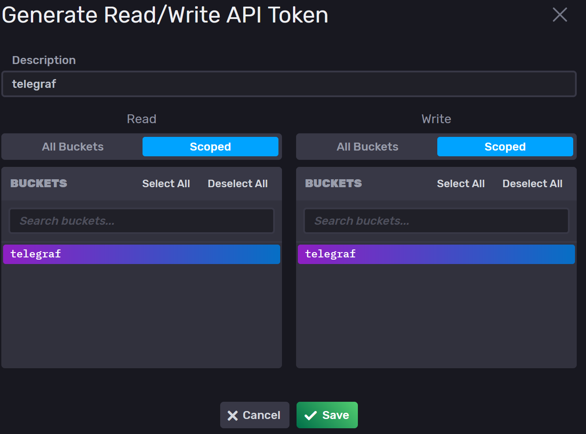

# **DRAFT** :: InfluxDBv2 :: **DRAFT**
## Create and update influxdb token
1. Start the stack
1. Open the influxdb web frontend `http://[IP-ADRESS]:[PORT]` (default: `http://localhost:8086`)
1. Login using your credentials
1. Create a new token
    1. Load Data > API Tokens > <kbd>+ Generate API Token</kbd> > Read/Write API Token
    
1. Copy token to `telegraf.conf`
1. Restart stack via `docker-compose restart`

## Add InfluxDB as Grafana Datasource
1. Login with your admin credentials
1. Configuration > Data sources > <kbd>Add data source</kbd> > InfluxDB
    1. Query Language: `Flux`
    1. URL: `http://[INFLUXDB_DOCKER_IP]:8086`
    1. InfluxDB Details
        1. Organization: `${INFLUXDB_ORG}`
        1. Token: `${INFLUXDB_API_TOKEN}`
        1. Default Bucket: `${INFLUXDB_BUCKET}`
    1. <kbd>Save & test</kbd>
